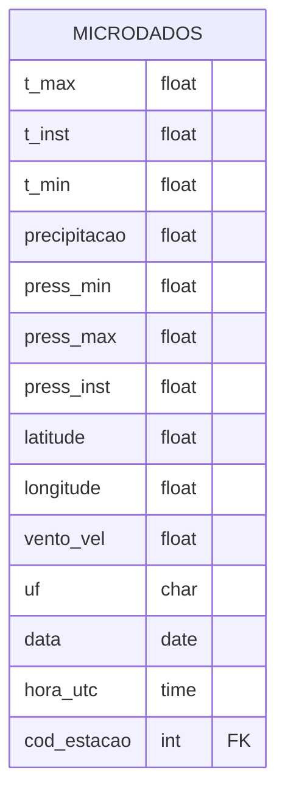

# Parte 1 – Modelagem e Arquitetura

## Desafio:

Você foi encarregado(a) de projetar o banco de dados para armazenar os dados climáticos horários dos últimos 10 anos, com cobertura para todo o Brasil. Considere que haverá cruzamentos espaciais frequentes com polígonos de municípios e áreas rurais.

Os dados disponibilizados acerca das grandezas medidas são obtidos de hora em hora e têm a seguinte estrutura:

- t_max: Temperatura máxima
- t_inst: Temperatura
- t_min: Temperatura
- precipitacao: precipitação em mm
- press_min: Pressão
- press_max: Pressão
- press_inst: Pressão
- latitude: em graus decimais (SIRGAS2000 - EPSG 4674)
- longitude: em graus decimais (SIRGAS2000 - EPSG 4674)
- vento_vel: Velocidade do vento em Km/h
- uf: Unidade da Federação
- data: Data da medição
- hora_utc: Hora em relação ao meridiano de Greenwitch
- cod_estacao: Código da estação meteorológica

## Pergunta

Apresente uma proposta de modelagem conceitual e física para esse cenário, destacando como você faria para ser:

- Escalável e de alta performance;
- Suportar cruzamentos espaciais e temporais com eficiência;
- Preservar a precisão e facilite análises históricas complexas;
- Permitir consultas ágeis com múltiplos filtros (tempo, localização, variável climática)

---

### Modelo de dados conceitual

@startuml
@startchen
entity microdados {
}
entity estacao {
}
relationship id_estacao {
}
estacao -1- id_estacao
id_estacao -N- microdados
@endchen
@enduml

### Modelo de dados logico



### Modelo de dados fisico

```sql
CREATE TABLE estacao (
    regiao varchar(2),
    uf varchar(2),
    estacao varchar,
    codigo varchar PRIMARY KEY,
    latitude numeric,
    longitude numeric,
    altitude numeric,
    data_fundacao date
);

CREATE TABLE microdados (
    ano int,
    data date,
    hora time,
    id_estacao int REFERENCES estacao (id),
    precipitacao_total numeric,
    pressao_atm_hora numeric,
    pressao_atm_max numeric,
    pressao_atm_min numeric,
    radiacao_global numeric,
    temperatura_bulbo_hora numeric,
    temperatura_orvalho_hora numeric,
    temperatura_max numeric,
    temperatura_min numeric,
    temperatura_orvalho_max numeric,
    temperatura_orvalho_min numeric,
    umidade_rel_max numeric,
    umidade_rel_min numeric,
    umidade_rel_hora numeric,
    vento_direcao numeric,
    vento_rajada_max numeric,
    vento_velocidade numeric
)
PARTITION BY RANGE (data);

CREATE TABLE microdados_y2025m01 PARTITION OF microdados
FOR VALUES FROM ('2025-01-01') TO ('2025-02-01');

CREATE TABLE microdados_y2025m02 PARTITION OF microdados
FOR VALUES FROM ('2025-02-01') TO ('2025-03-01');

...

CREATE INDEX ON microdados (data);
```
