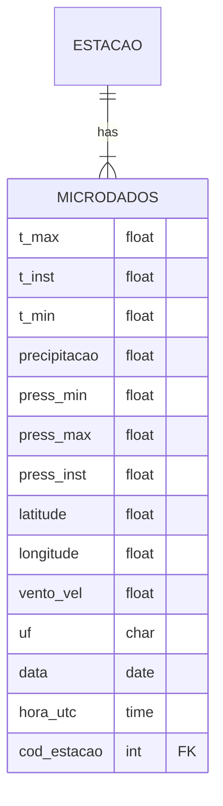

# Parte 1 – Modelagem e Arquitetura

## Modelo de dados conceitual

@startuml
@startchen

entity microdados {
}
entity estacao {
}
relationship id_estacao {
}

estacao -1- id_estacao
id_estacao -N- microdados

@endchen
@enduml

## Modelo de dados logico



## Modelo de dados fisico

```sql
CREATE TABLE estacao (
    regiao varchar(2),
    uf varchar(2),
    estacao varchar,
    codigo varchar PRIMARY KEY,
    latitude numeric,
    longitude numeric,
    altitude numeric,
    data_fundacao date
);

CREATE TABLE microdados (
    ano int,
    data date,
    hora time,
    id_estacao int REFERENCES estacao (id),
    precipitacao_total numeric,
    pressao_atm_hora numeric,
    pressao_atm_max numeric,
    pressao_atm_min numeric,
    radiacao_global numeric,
    temperatura_bulbo_hora numeric,
    temperatura_orvalho_hora numeric,
    temperatura_max numeric,
    temperatura_min numeric,
    temperatura_orvalho_max numeric,
    temperatura_orvalho_min numeric,
    umidade_rel_max numeric,
    umidade_rel_min numeric,
    umidade_rel_hora numeric,
    vento_direcao numeric,
    vento_rajada_max numeric,
    vento_velocidade numeric
)
PARTITION BY RANGE (data);

CREATE TABLE microdados_y2025m01 PARTITION OF microdados
FOR VALUES FROM ('2025-01-01') TO ('2025-02-01');

CREATE TABLE microdados_y2025m02 PARTITION OF microdados
FOR VALUES FROM ('2025-02-01') TO ('2025-03-01');

CREATE INDEX ON microdados (data);
```
